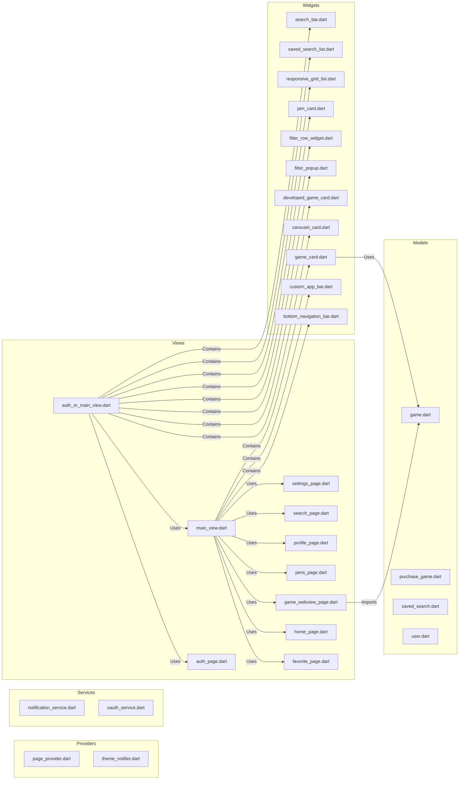
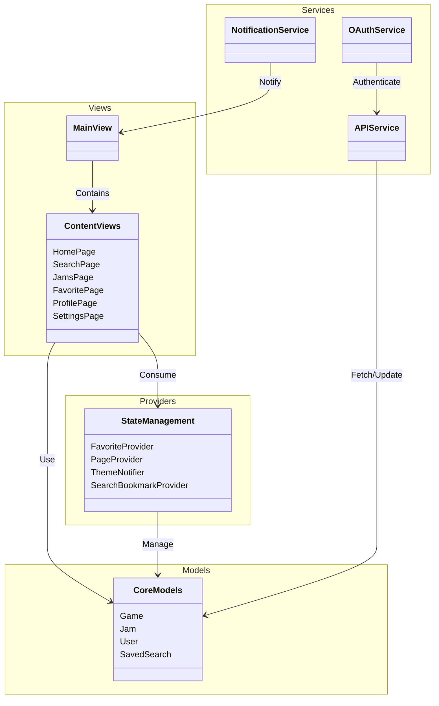

# Table of Contents

## 1. Introduction

### 1.1 Project Overview

Our app aims to transform the mobile experience on Itch.io, a platform widely used by gamers and developers from all the world.
During our Videogame course at Politecnico, we recognized the need for a dedicated mobile client, as relying on a mobile browser for Itch.io is cumbersome and limits functionality.

### 1.2 Purpose and Scope

The scope of the project includes various intended functionalities, such as navigation through games, events, and developer resources. The app aims to fill the gap in Itch.io's current mobile experience, which is considered poorly organized when accessed via a mobile browser. Key functionalities include browsing indie games, assets, tools, books, soundtracks, and other content available on Itch.io, creating a custom feed, receiving notifications on updates and new releases, personalized library management, and efficient game jam management. The focus is to make the user interact and explore new items as fast as possible on mobile. It's not a way to replace the website but is built on top of it to enhance the mobile experience.


### 1.3 Target Audience

The target audience for the app includes Itch.io users, game developers, and gamers. The app's features cater to their specific needs by providing a seamless and enhanced mobile experience, allowing users to explore, purchase, and manage indie games and content more effectively.

## 2. User Experience Design

### 2.1 Interface Design

The design principles guiding the app's user interface emphasize the importance of a responsive design that mirrors Itch.io’s style. The app aims to keep the user interface minimal while offering customization options. Each game/item page is embedded in a web view to preserve the developers' and publishers' personalized styles, backgrounds, and fonts.
The app ships with three themes that change its aesthetics, and there is an option for a theme that follows the device's overall theme.


### 2.2 User Interaction Flow

By enhancing the user interaction flow and providing detailed functional specifications, the ItchExplorer app aims to deliver a superior mobile experience for Itch.io users, developers, and gamers. 
The focus is to make user interaction and exploration of new items—such as games, assets, tools, books, and soundtracks—as fast and intuitive as possible on mobile. This app is not intended to replace the website but is built on top of it to enhance the mobile browsing experience.
The user journey within the app includes:

- **Advanced Search Options**: Utilize multiple filters to find specific games or content, such as genre, popularity, and release date.
- **Saving Items and Searches**: Save individual items to favorites or entire searches for easy access later.
- **Pinned Searches on Homepage**: Pin saved searches on the homepage, which users can customize to suit their needs modularly build the homepage by adding and arranging pinned searches, favorite games, and game jam trackers.
- **Tracking Game Jams**: Discover ongoing and upcoming game jams, add them to the in-app calendar, and track specific game jam submissions.

## Functional Specifications

The app will offer a seamless browsing experience, allowing users to explore a wide range of games, assets, tools, books, soundtracks, and other content hosted on Itch.io. Key features built on top of Itch.io are:

- **Advanced Search Filters**: Users can find specific games or content using multiple criteria, such as genre, popularity, and release date.
- **Categories and Recommendations**: Browse through various categories and receive personalized game recommendations based on user preferences and past interactions.

### Customization of Homepage

Users can customize their homepage by:

- **Pinning Searches and Favorites**: Pin important searches and favorite games for quick access.
- **Modular Layout**: Rearrange elements on the homepage to prioritize what matters most, creating a tailored and personal experience.

### Receiving Notifications

Integration with Google Firebase will enable efficient management of notifications:

- **Customizable Settings**: Users can customize notification settings to receive updates about game releases, updates, and other important information.
- **Real-Time Alerts**: Stay informed with real-time notifications about the latest developments in the Itch.io community. 

### Participating in Game Jams

Users can participate in game jams, which are rapid game development events. The app will provide functionalities to:

- **Discover and Track Jams**: Easily find and track game jams, including adding them to a calendar within the app.
- **Save and Follow Submissions**: Save and follow specific game jam submissions, keeping up-to-date with their progress.


## 4. Technical Architecture

The app is designed with a robust architecture that ensures scalability, maintainability, and performance. The architecture consists of the following components:

### Front-End (Flutter)

The **presentation layer** is developed using Flutter, which handles the user interface and user experience aspects. This layer includes various screens, widgets, and UI components that users interact with.

In selecting Flutter for app development, we acknowledge its robust capabilities in crafting high-quality, natively compiled applications for mobile, web, and desktop from a single codebase. This cross-platform development framework, powered by the Dart programming language, is a game-changer for efficient app development.

**Advantages of Flutter:**

- **Cross-Platform Efficiency:** Flutter allows us to write one codebase for both iOS and Android platforms, significantly reducing development time and resources.
- **Rich Widget Catalog:** With a comprehensive array of customizable widgets, Flutter makes it easier to create a responsive and attractive UI that aligns with Itch.io's design aesthetics.
- **Performance:** Flutter's engine renders directly onto the canvas provided by the platform, which means there is no need for a bridge to communicate with native components. This results in high-performance applications that feel smooth and native.
- **Hot Reload:** This feature enhances developer productivity by enabling instant viewing of code changes without the need for a full rebuild.
- **Strong Community and Support:** Flutter's growing community and the support from Google ensure a wealth of resources and regular updates.

#### Back-End (Firebase and Other Services)

- **Firebase Authentication**: Manages user authentication using various providers such as Google, Facebook, and email/password.
- **Firebase Firestore**: Serves as the primary database for storing user data, game information, favorites, and other app-related data. Firestore provides real-time synchronization and offline support.
- **Firebase Cloud Messaging (FCM)**: Handles push notifications, ensuring users receive timely updates about game releases, updates, and other relevant information.
- **Cloud Functions**: Used for server-side logic, such as sending notifications, managing complex queries, and performing backend tasks that require server-side processing.

#### Interaction Between Components

1. **User Authentication**:
   - User both authenticate with Itch.io and with our backend. After successful authentication, a user token is generated and used for subsequent interactions with both Itch.io and Firebase services.
   - Users authenticate through the Flutter front-end, which interacts with Firebase Authentication.
2. **Data Management**:
   - The Flutter app fetches and manipulates data stored in Firebase Firestore.
   - Any changes made by the user, such as adding a game to favorites or tracking a game jam, are updated in real-time in Firestore.
3. **Notifications**:
   - The app subscribes to specific topics or events using FCM.
   - Notifications about game updates, new releases, or game jam reminders are sent from Cloud Functions to FCM, which then pushes them to the user's device.
4. **Content Storage and Retrieval**:
   - User-uploaded content and game assets are stored in Firebase Storage.
   - The Flutter app retrieves and displays this content as needed, ensuring a seamless user experience.

By leveraging Flutter for front-end development and Firebase for backend services, the ItchExplorer app ensures a high-performance, scalable, and maintainable solution that enhances the mobile experience for Itch.io users.

## 5. Notification System Design

### 5.1 Using Google Firebase

Google Firebase was chosen for handling notifications due to its efficiency, scalability, and ease of integration with Flutter:

- **Efficiency**: Firebase Cloud Messaging (FCM) is designed to deliver notifications with minimal latency. It ensures that users receive timely updates on their devices.
- **Scalability**: Firebase can handle a large number of notifications and user interactions without performance degradation, making it suitable for apps with growing user bases.
- **Ease of Integration**: Firebase integrates seamlessly with Flutter, simplifying the implementation process. Firebase SDKs are well-documented and provide out-of-the-box support for push notifications, analytics, and other services.
- **Real-Time Updates**: Firebase Firestore supports real-time data synchronization, ensuring that notifications and other data updates are propagated instantly across all user devices.

### 5.2 Notification Features

The notification system will cover a variety of user notifications, including new game releases, updates, discounts, and game jam reminders. The implementation strategy using Firebase Cloud Messaging (FCM) is as follows:

- **New Releases**: When a new game is released, users who have subscribed to notifications for that game or genre will receive an instant notification.
- **Updates**: Users will receive notifications for updates on games they follow or have in their library, ensuring they stay informed about new features or bug fixes.
- **Discounts**: Notifications will be sent to users about discounts on games they have shown interest in, either by viewing or adding to their wishlist.
- **Game Jam Reminders**: Users participating in or following game jams will receive reminders about upcoming deadlines, new submissions, and other important updates.

### Implementation Strategy

To implement these features, Firebase Cloud Messaging (FCM) will be integrated with the backend and the Flutter app. Below is an example of the backend implementation using Firebase Functions and Itch.io API:

## 6. Third-Party Integrations

The ItchExplorer app will integrate with several third-party services to enhance its functionality and provide a seamless user experience. These integrations include:

- **Itch.io API**: For fetching game data, user information, and other content from Itch.io.
- **Cheerio and Axios**: For web scraping and data retrieval from Itch.io.
- **RSS Feeds**: For fetching updates and news from Itch.io and other relevant sources.
- **Google Firebase**: For authentication, real-time database, cloud messaging, and storage.

These integrations will ensure that the app remains up-to-date with the latest content and provides users with a rich and engaging experience.f the backend implementation using Firebase Functions and Itch.io API:

#### Server-side API

The server-side API allows communication with your Itch.io account via an API key. This enables the app to make queries and changes on behalf of the user. Key functionalities include:

- **Fetching game data**: Retrieve detailed information about games hosted on Itch.io.
- **User account management**: Update user account details and preferences.
- **Game management**: Manage games, including uploading new builds and updating existing ones.

**Documentation**: [Server-side API Documentation](https://itch.io/docs/api/server)

**API Endpoints**:
- **Credentials Information**: `GET /api/1/KEY/credentials/info`
- **User Profile**: `GET /api/1/KEY/me`
- **User Games**: `GET /api/1/KEY/my-games`
- **Download Keys**: `GET /api/1/KEY/game/GAME_ID/download_keys`
- **Game Purchases**: `GET /api/1/KEY/game/GAME_ID/purchases`

Passing Parameters is possible using GET requests, inserted in the query string.

   ```http
   GET /api/1/YOUR_API_KEY/credentials/info
   Authorization: Bearer YOUR_API_KEY
   ```

   Sample response for API key:
   ```json
   {
     "scopes": [ "profile:me", "profile:games" ]
   }
   ```

2. **Fetch User Profile Data**
   ```http
   GET /api/1/YOUR_API_KEY/me
   Authorization: Bearer YOUR_API_KEY
   ```

   Sample response:
   ```json
   {
     "user": {
       "username": "fasterthanlime",
       "gamer": true,
       "display_name": "Amos",
       "cover_url": "https://img.itch.zone/aW1hZ2UyL3VzZXIvMjk3ODkvNjkwOTAxLnBuZw==/100x100%23/JkrN%2Bv.png",
       "url": "https://fasterthanlime.itch.io",
       "press_user": true,
       "developer": true,
       "id": 29789
     }
   }
   ```

3. **Fetch User Games**
   ```http
   GET /api/1/YOUR_API_KEY/my-games
   Authorization: Bearer YOUR_API_KEY
   ```

   Sample response:
   ```json
   {
     "games": [
       {
         "cover_url": "http://img.itch.io/aW1hZ2UvMy8xODM3LnBuZw==/315x250%23/y2uYQI.png",
         "created_at": "2013-03-03 23:02:14",
         "downloads_count": 109,
         "id": 3,
         "min_price": 0,
         "p_android": false,
         "p_linux": true,
         "p_osx": true,
         "p_windows": true,
         "published": true,
         "published_at": "2013-03-03 23:02:14",
         "purchases_count": 4,
         "short_text": "Humans have been colonizing planets. It's time to stop them!",
         "title": "X-Moon",
         "type": "default",
         "url": "http://leafo.itch.io/x-moon",
         "views_count": 2682,
         "earnings": [
           {
             "currency": "USD",
             "amount_formatted": "$50.47",
             "amount": 5047
           }
         ]
       }
     ]
   }
   ```

#### OAuth Applications

OAuth applications allow making requests to the Itch.io API on behalf of another user. This is useful for creating websites or games that process user data.

**Documentation**: [OAuth Applications Documentation](https://itch.io/docs/api/oauth)

**Steps**:
1. **Registering an OAuth Application**: Manage OAuth applications from your user settings.
2. **Authorization Step**: Redirect users to `https://itch.io/user/oauth` with necessary parameters (`client_id`, `scope`, `redirect_uri`, and optional `state`).
3. **Retrieve Access Token**: After user grants permissions, retrieve the access token from the hash part of the URL using JavaScript.
4. **Use Access Token**: Use the access token to make API requests as described in the server-side API docs.
5. **Security Considerations**: Only request necessary scopes, use HTTPS for the OAuth callback page, and use a `state` parameter to prevent attacks.

#### JavaScript API

The JavaScript API allows embedding custom buy buttons on external sites, enabling developers to promote their games through the ItchExplorer app.

**Documentation**: [JavaScript API Documentation](https://itch.io/docs/api/javascript)

#### Widget API

The Itch.io widget is an iframe-based snippet of HTML that can be embedded into existing pages, providing a seamless browsing and purchasing experience directly within the app.

**Documentation**: [Widget API Documentation](https://itch.io/docs/api/widget)

#### RSS Feeds

RSS feeds allow users to subscribe to updates and new content on Itch.io. The app will use these feeds to keep users informed about the latest game uploads, featured games, and active sales.

- **Latest Games Uploaded**: [New Games Feed](http://itch.io/feed/new.xml)
- **Featured Games**: [Featured Games Feed](http://itch.io/feed/featured.xml)
- **Active Sales**: [Active Sales Feed](http://itch.io/feed/sales.xml)

For any browse page URL, such as [Free Games](http://itch.io/games/price-free), users can append `.xml` to the end of the URL to access the corresponding RSS feed (e.g., [Free Games RSS Feed](http://itch.io/games/price-free.xml)).

### 6.2 Google Firebase

Google Firebase will be integral to the ItchExplorer app, providing several backend services to enhance user experience and app functionality.

- **Firebase Authentication**: Manages user login and sessions securely using various authentication providers, including Google, Facebook, and email/password.
- **Firebase Firestore**: Acts as the primary database for storing user data, game information, favorites, and other app-related data, supporting real-time synchronization and offline access.
- **Firebase Cloud Messaging (FCM)**: Sends push notifications to users, ensuring they receive timely updates on game releases, updates, and other relevant information.
- **Firebase Storage**: Stores user-uploaded content such as profile pictures and game assets.
- **Cloud Functions**: Executes server-side logic for tasks such as sending notifications, managing complex queries, and performing backend processing.

### 6.3 Web Scraping and Data Retrieval

The app will utilize web scraping tools like Cheerio and Axios to fetch data directly from Itch.io pages. This approach will be used to complement the API integrations, ensuring comprehensive data coverage and access to the latest content.

- **Cheerio**: Parses HTML content to extract data from Itch.io pages, enabling the app to retrieve game details, user profiles, and other relevant information.
- **Axios**: Makes HTTP requests to fetch data from Itch.io, including HTML pages and RSS feeds, for further processing and display within the app.

### 6.4 RSS Feeds

RSS feeds are an integral part of keeping users updated with the latest content from Itch.io. The app will subscribe to various RSS feeds to fetch updates on new games, featured games, and active sales.

- **New Games Feed**: [http://itch.io/feed/new.xml](http://itch.io/feed/new.xml)
- **Featured Games Feed**: [http://itch.io/feed/featured.xml](http://itch.io/feed/featured.xml)
- **Active Sales Feed**: [http://itch.io/feed/sales.xml](http://itch.io/feed/sales.xml)

By

 leveraging these third-party integrations, the ItchExplorer app ensures a rich, up-to-date, and engaging user experience, providing seamless access to Itch.io's diverse content and features.
## 7. Responsive and Adaptive Design

### 7.1 Design Principles

Responsive and adaptive design principles are critical for creating a seamless user experience across various devices and screen sizes. In the context of Flutter, these principles are facilitated by Flutter’s powerful widget system, which allows for:

- **Flexibility**: Flutter’s widgets are highly customizable and can adapt to different screen sizes and orientations. 
- **Scalability**: The use of responsive design ensures that the app looks and functions well on both small screens (like phones) and larger screens (like tablets). Flutter’s `LayoutBuilder` and `Constraints` widgets help manage different layout requirements based on screen size.
- **Consistency**: Adaptive design ensures that the app provides a consistent user experience by adjusting its UI elements to fit the device's form factor and user input methods. For example, touch interfaces on phones and tablets are optimized for finger interactions.

### 7.2 Device Compatibility

To ensure compatibility and optimal user experience across various devices and screen sizes, the app will focus on:

- **Responsive Layouts**: Using Flutter’s flexible layout widgets to create interfaces that adapt to different screen sizes and orientations.
- **Adaptive UI Elements**: Implementing adaptive UI components that adjust their size, padding, and alignment based on the device’s dimensions and resolution.
- **Testing on Multiple Devices**: Regular testing on a range of Android phones and tablets to identify and resolve any compatibility issues.
- **Optimized Performance**: Ensuring the app performs efficiently across all supported devices, leveraging Flutter’s capabilities to maintain smooth animations and interactions.

## 8. Development Best Practices

### 8.1 Flutter Development Best Practices

To maintain high-quality code and efficient development workflows, the following Flutter-specific best practices will be adhered to:

- **Effective State Management**: Utilizing state management solutions like **Provider** to manage app state in a predictable and maintainable way.
- **Widget Composition**: Breaking down the UI into small, reusable widgets to promote code reuse and simplify testing and maintenance.
- **Adhering to Dart Programming Style**: Following the Dart language style guide, including proper naming conventions, code organization, and documentation practices.


```shell
├───custom_icons
│       custom_icon_icons.dart
│
├───models
│       game.dart
│       item.dart
│       jam.dart
│       jam_game.dart
│       purchase_game.dart
│       saved_search.dart
│       user.dart
│
├───providers
│       favorite_provider.dart
│       page_provider.dart
│       search_bookmark_provider.dart
│       theme_notifier.dart
│
├───services
│       notification_service.dart
│       oauth_service.dart
│
├───views
│   │   auth_or_main_view.dart
│   │   auth_page.dart
│   │   favorite_page.dart
│   │   game_webview_page.dart
│   │   home_page.dart
│   │   jams_page.dart
│   │   main_view.dart
│   │   profile_page.dart
│   │   search_page.dart
│   │   settings_page.dart
│   │
│   ├───widgets
│   │       bottom_navigation_bar.dart
│   │       carousel_card.dart
│   │       custom_app_bar.dart
│   │       developed_game_card.dart
│   │       filter_popup.dart
│   │       filter_row_widget.dart
│   │       game_card.dart
│   │       jam_card.dart
│   │       responsive_grid_list.dart
│   │       saved_search_list.dart
│   │       search_bar.dart
│   bottom_navigation_wrapper.dart
│   firebase_options.dart
│   main.dart
```




### 8.2 Version Control and Collaboration

Using version control and collaboration tools is essential for maintaining a coherent and efficient development process:
- **Version Control**: Using Git for source code management, with a clear branching strategy (e.g., feature branches, development branch, and main branch) to manage code changes and releases.
- **Collaboration Tools**: Utilizing tools like GitHub or GitLab for code hosting, pull requests, and code reviews. Integrating these tools with continuous integration (CI) systems to automate testing and deployment.
- **Documentation**: Keeping comprehensive documentation of the codebase, development processes, and API integrations to facilitate collaboration and onboarding of new team members.

## 9. Testing and Quality Assurance

### 9.1 Testing Strategy in Flutter

A comprehensive testing strategy is crucial for ensuring the app’s quality and reliability:
- **Unit Testing**: Writing unit tests to validate the behavior of individual functions and classes.
- **Widget Testing**: Creating widget tests to verify the correctness of the UI components and their interactions.
- **Integration Testing**: Implementing integration tests to ensure that different parts of the app work together as expected.
- **Automated Testing**: Leveraging Flutter’s testing framework and CI tools to automate the execution of tests, providing continuous feedback on code quality.

### 9.2 Quality Assurance Practices

To maintain high standards of quality, the following practices will be implemented:
- **Code Reviews**: Conducting regular code reviews to ensure code quality, consistency, and adherence to best practices.
- **Continuous Integration**: Setting up CI pipelines to automatically run tests, build the app, and deploy it to staging environments.
- **Performance Monitoring**: Using tools to monitor the app’s performance and detect issues such as memory leaks, slow rendering, and high CPU usage.

## 10. Project Timeline and Milestones

### 10.1 Development Phases

The project will be broken down into the following phases, each with tentative timelines:

1. **Concept Phase**: Define the project scope, objectives, and initial requirements (2 weeks).
2. **Design Phase**: Create detailed UI/UX designs, wireframes, and prototypes (4 weeks).
3. **Development Phase**: Implement the app’s features, integrate third-party services, and develop the backend (12 weeks).
4. **Testing Phase**: Conduct thorough testing, including unit, widget, and integration tests (4 weeks).
5. **Deployment Phase**: Finalize the app, prepare for release, and deploy to app stores (2 weeks).

### 10.2 Key Milestones

Key milestones within each phase will include:

- **Concept Phase**: Project kickoff, requirements gathering, and initial planning.
- **Design Phase**: Completion of UI/UX designs, approval of wireframes, and prototype testing.
- **Development Phase**: Alpha release, beta testing, and feature completion.
- **Testing Phase**: Completion of all tests, bug fixing, and performance optimization.
- **Deployment Phase**: App submission to app stores, marketing launch, and post-launch support.

## 11. Conclusion

### 11.1 Summary of Objectives

The primary objectives of the ItchExplorer app are to enhance the mobile experience for Itch.io users by providing a feature-rich, responsive, and intuitive application. The app aims to support game developers, gamers, and the Itch.io community by offering seamless navigation, real-time updates, and efficient content management.

### 11.2 Future Prospects

Looking ahead, the app has potential for future enhancements and scalability:
- **User Feedback**: Continuously gathering user feedback to identify areas for improvement and new feature requests.
- **Technological Advancements**: Leveraging advancements in mobile and web technologies to keep the app up-to-date and competitive.
- **Community Engagement**: Building a strong community around the app, encouraging user engagement and contributions.
- **Feature Expansion**: Adding new features such as in-app messaging, advanced analytics, and enhanced social sharing capabilities.

By focusing on these objectives and future prospects, the ItchExplorer app aims to become an indispensable tool for the Itch.io community, fostering growth and engagement within the indie game ecosystem.


