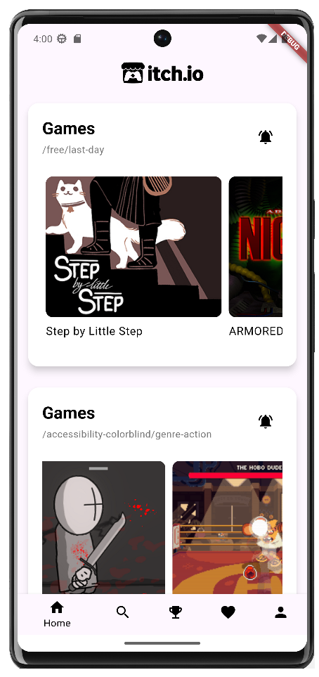
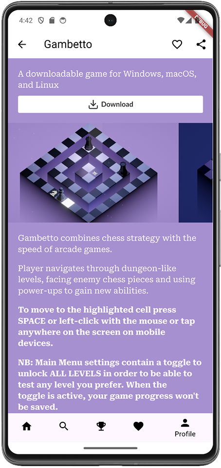
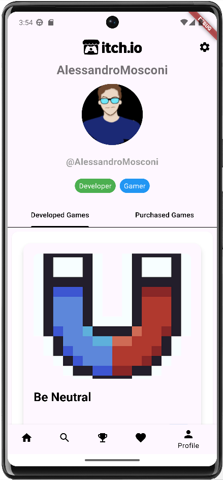
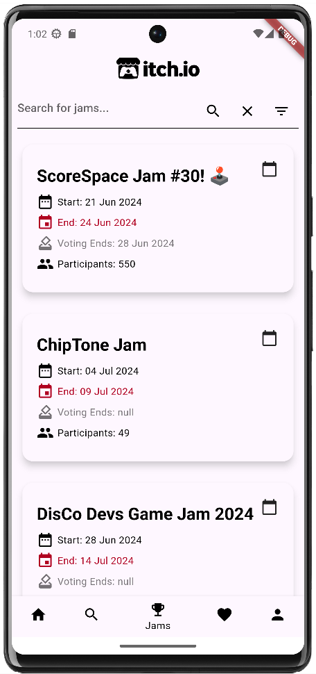
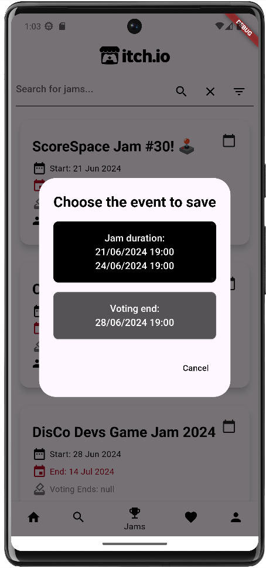
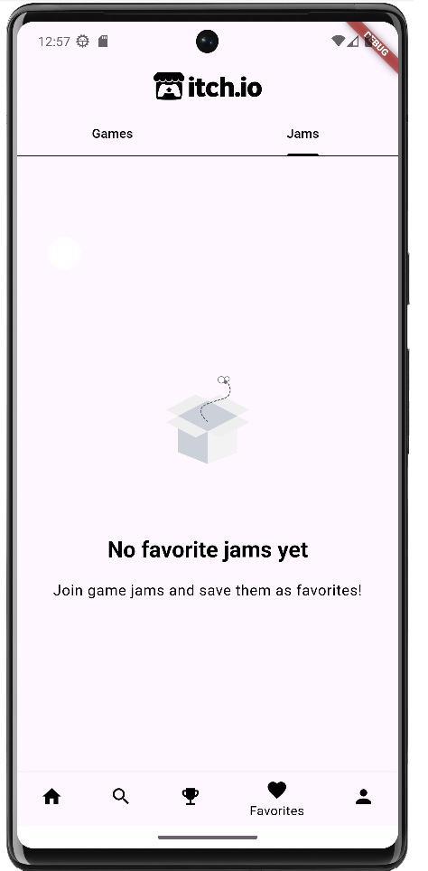

\maketitle
\newpage
\tableofcontents
\newpage

# Introduction

## Project Overview

Our app aims to transform the mobile experience on Itch.io, a platform widely used by gamers and developers from all the world.
The focus is to make exploration of new items—such as games, assets, tools, books, and soundtracks—as fast and intuitive as possible on mobile. 

## Purpose and Scope

The app aims to fill the gap in Itch.io's current mobile experience, which is considered poorly organized when accessed via a mobile browser. 

During our Videogame course at Politecnico, we recognized the need for a dedicated mobile client, as relying on a mobile browser for Itch.io is cumbersome and limits functionality.

Key functionalities include browsing indie games, assets, tools, books, soundtracks, and other content available on Itch.io, creating a custom feed, receiving notifications on updates and new releases, personalized library management, and efficient game jam management. 

## Target Audience

The target audience for the app includes Itch.io users, game developers, and gamers. The app's features cater to their specific needs by providing a seamless and enhanced mobile experience, allowing users to explore, purchase, and manage indie games and content more effectively.

# User Experience Design

## Interface Design

The design principles guiding the app's user interface emphasize the importance of a responsive design that mirrors Itch.io’s style. The app aims to keep the user interface minimal while offering customization options. 

{width=50%} 
{width=50%} 
Each game/item page is embedded in a web view to preserve the developers' and publishers' personalized styles, backgrounds, and fonts. With addon such as share and save as favorite buttons.

{width=50%}

The app ships with multiple themes that change its aesthetics, and there is an option for a theme that follows the device's overall theme.

## User Interaction Flow

The user journey within the app includes:

- **Search Options**: Utilize multiple filters to find specific games or content, such as genre, popularity, and release date.
- **Pinned Searches on Homepage**: Modularly build the homepage by adding and arranging pinned searches.
- **Alerts on pinned searches**: Active a notification system for changes in the saved searches to be notified when search results change. 
- **Saving Items and Searches**: Save individual items to favorites or entire searches for easy access later.
- **Tracking Game Jams**: Discover ongoing and upcoming game jams, add them to the in-app calendar.

# Functional Specifications

The app will offer a seamless browsing experience, allowing users to explore a wide range of games, assets, tools, books, soundtracks, and other content hosted on Itch.io.

## Customization of Homepage and Browsing

Users can customize their homepage by:

- **Pinning Searches and Favorites**: Pin important searches and favorite games for quick access.
- **Modular Layout**: Rearrange elements on the homepage to prioritize what matters most, creating a tailored and personal experience.

 

## User profile handling

User can consult and check their profiles including developed and purchased games:

|      |  | 
:-------------------------:|:-------------------------:
|  | | 

## Jam browsing

User can browse different jams by searching them with a text query or by filtering them by date:

- **Jams Browsing**: Search different jam with custom filters.
- **Save jams to calendar**: Save jams duration and voting ends date in device calendar app

|         |  | 
:-------------------------:|:-------------------------:
{width=50%} | {width=50%}  | 

## Favorite managing

User can check games and jams marked as favorite during previous searches 

|         |  | 
:-------------------------:|:-------------------------:
{width=50%}| {width=50%} | 

## Receiving Notifications

Integration with Google Firebase will enable efficient management of notifications:

- **Customizable Settings**: Users can customize notification settings to receive updates about game releases, updates, and other important information.
- **Real-Time Alerts**: Real-time notifications about the latest developments in the Itch.io community. 

## Finding and tracking Game Jams

Users can find and track game jams, which are rapid game development events. The app will provide functionalities to:

- **Discover and Track Jams**: Easily find and track game jams, including adding them to a calendar within the app.
- **Save and Follow Submissions**: Save and follow specific game jam submissions, keeping up-to-date with their progress.

# Technical Architecture

## Front-End (Flutter)

The **presentation layer** is developed using Flutter, which handles the user interface and user experience aspects. This layer includes various screens (views), which group widgets and UI components that users interact with.

{width=50%}

**Advantages of Flutter:**

- **Cross-Platform Efficiency:** Flutter allows us to write one codebase for both iOS and Android platforms, significantly reducing development time and resources.
- **Rich Widget Catalog:** With a comprehensive array of customizable widgets, Flutter makes it easier to create a responsive and attractive UI that aligns with Itch.io's design aesthetics.
- **Performance:** Flutter's engine renders directly onto the canvas provided by the platform, which means there is no need for a bridge to communicate with native components. This results in high-performance applications that feel smooth and native.
- **Hot Reload:** This feature enhances developer productivity by enabling instant viewing of code changes without the need for a full rebuild.
- **Strong Community and Support:** Flutter's growing community and the support from Google ensure a wealth of resources and regular updates.

## Back-End (Firebase and Other Services)

The **back-end** apart from using Itch.io, is based on Firebase. Firebase is a set of backend cloud computing services and application development platforms provided by Google. It hosts databases, services, authentication, and integration for our application.

- **Itchio Authentication**
- **Firebase Realtime Database**: Serves as the primary database for storing user data like favorite games, saved searches and notification/alert settings. 
- **Firebase Cloud Messaging (FCM)**: Handles push notifications, ensuring users receive timely updates about game releases and updates.
- **Cloud Functions**: Used for server-side logic, such as sending notifications, managing complex queries, and performing backend tasks that require server-side processing.

### Interaction Between Components

1. **User Authentication**:
   - User both authenticate with Itch.io or directly with our backend if previously logged. After successful authentication, a user token is generated and used for subsequent interactions with both Itch.io and Firebase services.
   - Users authenticate through the Flutter front-end, which interacts with Itch.io Authentication.
2. **Data Management**:
   - The Flutter app fetches and manipulates data stored both in Firebase Realtime Database and in Itch.io.
   - Any changes made by the user, such as adding a game to favorites or tracking a game jam, are updated in real-time in Firebase.
3. **Notifications**:
   - The app subscribes to specific topics or events using FCM.
   - Notifications about game updates, new releases, or game jam reminders are sent from Cloud Functions to FCM, which then pushes them to the user's device.

By leveraging Flutter for front-end development and Firebase for backend services, the app ensures a high-performance, scalable, and maintainable solution that enhances the mobile experience for Itch.io users.

# Notification System Design

## Using Google Firebase

Google Firebase was chosen for handling notifications due to its efficiency, scalability, and ease of integration with Flutter:

- **Efficiency**: Firebase Cloud Messaging (FCM) is designed to deliver notifications with minimal latency. It ensures that users receive timely updates on their devices.
- **Scalability**: Firebase can handle a large number of notifications and user interactions without performance degradation, making it suitable for apps with growing user bases.
- **Ease of Integration**: Firebase integrates seamlessly with Flutter, simplifying the implementation process. Firebase SDKs are well-documented and provide out-of-the-box support for push notifications, analytics, and other services.
- **Real-Time Updates**: Firebase Firestore supports real-time data synchronization, ensuring that notifications and other data updates are propagated instantly across all user devices.

## Notification Features

The notification system will cover a variety of user notifications, including new game releases, updates, discounts, and game jam reminders. The implementation strategy using Firebase Cloud Messaging (FCM) is that when a saved search returns a different search results sends the changes to users who have subscribed to notifications for that search.

In this way users can for example **track discounts**: Users which has saved searches with "on sale" and "last week" filters can see what are the games that are on sale in the current week.

To implement these features, Firebase Cloud Messaging (FCM) will be integrated with the backend and the Flutter app. 

# Third-Party Integrations

The Itch.io app will integrate with several third-party services to enhance its functionality and provide a seamless user experience. 

## OAuth API

OAuth applications allow making requests to the Itch.io API on behalf of another user. This is useful for creating websites or games that process user data like in our case. 
Key functionalities include:

- **Fetching game data**: Retrieve detailed information about games hosted on Itch.io.
- **User account management**: Update user account details and preferences.
- **Game management**: Manage games, including uploading new builds and updating existing ones.

**Steps**:

1. **Registering an OAuth Application**: Manage OAuth applications from your user settings.
2. **Authorization Step**: Redirect users to `https://itch.io/user/oauth` with necessary parameters (`client_id`, `scope`, `redirect_uri`, and optional `state`).
3. **Retrieve Access Token**: After user grants permissions, retrieve the access token from the hash part of the URL using JavaScript.
4. **Use Access Token**: Use the access token to make API requests as described in the server-side API docs.
5. **Security Considerations**: Only request necessary scopes, use HTTPS for the OAuth callback page, and use a `state` parameter to prevent attacks.

Example of API Endpoints ([Itch.io API Documentation](https://itch.io/docs/api/server)):

- Credentials Information: `GET /api/1/KEY/credentials/info`
- User Profile: `GET /api/1/KEY/me`
- User Games: `GET /api/1/KEY/my-games`
- Download Keys: `GET /api/1/KEY/game/GAME_ID/download_keys`
- Game Purchases: `GET /api/1/KEY/game/GAME_ID/purchases`

Passing parameters is possible using GET requests, inserted in the query string.

| | |
:---:|:---:
| {width=50%} | {width=50%} | 

## RSS Feeds

RSS feeds allow users to subscribe to updates and new content on Itch.io. The app will use these feeds to keep users informed about the latest game uploads, featured games, and active sales.

For any browse page URL, such as `http://itch.io/games/price-free`, appending `.xml` to the end of the URL to access the corresponding RSS feed `http://itch.io/games/price-free.xml`.

Other examples of RSS feeds:

- Latest Games Uploaded: `http://itch.io/feed/new.xml`
- Featured Games: `http://itch.io/feed/featured.xml`
- Active Sales: `http://itch.io/feed/sales.xml`

We used libraries such Axios to make HTTP requests to both our Firebase backend and the RSS feeds, for further processing and display within the app.

## Web View and Data Retrieval

Also the web view of game and jams pages are used since each developer customize them with custom background, layouts and fonts. We used web scraping tools like Cheerio to remove the bars of Itch.io web page to make a continuity in the design of our application.

## Google Firebase

Google Firebase will be integral to the ItchExplorer app, providing several backend services to enhance user experience and app functionality.

- **Firebase Realtime Database**: Acts as the primary database for storing user data, game information, favorites, and other app-related data, supporting real-time synchronization and offline access.
- **Firebase Cloud Messaging (FCM)**: Sends push notifications to users, ensuring they receive timely updates on game releases, updates, and other relevant information.
- **Cloud Functions**: Executes server-side logic for tasks such as sending notifications, managing complex queries, and performing backend processing.

# Responsive and Adaptive Design

## Design Principles

Responsive and adaptive design principles are critical for creating a seamless user experience across various devices and screen sizes. In the context of Flutter, these principles are facilitated by Flutter’s powerful widget system, which allows for:

- **Flexibility**: Flutter’s widgets are highly customizable and can adapt to different screen sizes and orientations. 
- **Scalability**: The use of responsive design ensures that the app looks and functions well on both small screens (like phones) and larger screens (like tablets). Flutter’s `LayoutBuilder` and `Constraints` widgets help manage different layout requirements based on screen size.
- **Consistency**: Adaptive design ensures that the app provides a consistent user experience by adjusting its UI elements to fit the device's form factor and user input methods. For example, touch interfaces on phones and tablets are optimized for finger interactions.

## Device Compatibility

To ensure compatibility and optimal user experience across various devices and screen sizes, the app will focus on:

- **Responsive Layouts**: Using Flutter’s flexible layout widgets to create interfaces that adapt to different screen sizes and orientations.
- **Adaptive UI Elements**: Implementing adaptive UI components that adjust their size, padding, and alignment based on the device’s dimensions and resolution.
- **Testing on Multiple Devices**: Regular testing on a range of Android phones and tablets to identify and resolve any compatibility issues.
- **Optimized Performance**: Ensuring the app performs efficiently across all supported devices, leveraging Flutter’s capabilities to maintain smooth animations and interactions.

# Development Best Practices

## Flutter Development Best Practices

To maintain high-quality code and efficient development workflows, the following Flutter-specific best practices will be adhered to:

- **Effective State Management**: Utilizing state management solutions like **Provider** to manage app state in a predictable and maintainable way.
- **Widget Composition**: Breaking down the UI into small, reusable widgets to promote code reuse and simplify testing and maintenance.
- **Adhering to Dart Programming Style**: Following the Dart language style guide, including proper naming conventions, code organization, and documentation practices.

## Version Control and Collaboration

Using version control and collaboration tools is essential for maintaining a coherent and efficient development process:

- **Version Control**: Using Git for source code management, with a clear branching strategy (e.g., feature branches, development branch, and main branch) to manage code changes and releases.
- **Collaboration Tools**: Utilizing tools like GitHub for code hosting, pull requests, and code reviews.
- **Documentation**: Keeping comprehensive documentation of the codebase, development processes, and API integrations to facilitate collaboration and onboarding of new team members.

# Testing

## Testing Strategy in Flutter

A comprehensive testing strategy is crucial for ensuring the app’s quality and reliability:

- **Unit Testing**: Writing unit tests to validate the behavior of individual functions and classes. In our case the models folder.
- **Widget Testing**: Creating widget tests to verify the correctness of the UI components and their interactions.
- **Integration Testing**: Implementing integration tests to ensure that different parts of the app work together as expected. In our case the views folder.

| Test Type    | Coverage | Number of tests |
|--------------|----------|----------|
| Unit Tests (models folder)   | 90% files, 97% lines | 19 tests |
| Widget Tests (widget folder) | 100% files, 96 % lines covered   | 30 tests |
| Integration Tests (views folder) | 90% files, 90% lines covered   | 36 tests |

# Project Timeline and Milestones

## Development Phases

The project will be broken down into the following phases, each with tentative timelines:

1. **Concept Phase**: Define the project scope, objectives, and initial requirements (1 week).
2. **Design Phase**: Create detailed UI/UX designs, wireframes, and prototypes (2 weeks).
3. **Development Phase**: Implement the app’s features, integrate third-party services, and develop the backend (10 weeks).
4. **Testing Phase**: Conduct thorough testing, including unit, widget, and integration tests (3 weeks).
5. **Deployment Phase**: Finalize the app fixing last bugs (3 weeks).

## Key Milestones

Key milestones within each phase will include:

- **Concept Phase**: Project kickoff, requirements gathering, and initial planning.
- **Design Phase**: Completion of UI/UX designs, approval of wireframes, and prototype testing.
- **Development Phase**: Alpha release, beta testing, and feature completion.
- **Testing Phase**: Completion of all tests, bug fixing, and performance optimization.
- **Deployment Phase**: App submission to app stores, marketing launch, and post-launch support.

# Conclusion

The primary objectives of this app are to enhance the mobile experience for Itch.io users by providing a feature-rich, responsive, and intuitive application. The app aims to support game developers, gamers, and the Itch.io community by offering seamless navigation, real-time updates, and efficient content management (which were not present in orginial Itch.io website).

## Future Prospects

Looking ahead, the app has potential for future enhancements and scalability:

- **User Feedback**: gathering user feedback to identify areas for improvement and new feature requests.
- **Community Engagement**: Building a strong community around the app and leveraging the already present itch.io community, encouraging user engagement and contributions.
- **Feature Expansion**: Adding new features regarding the interaction between users.
