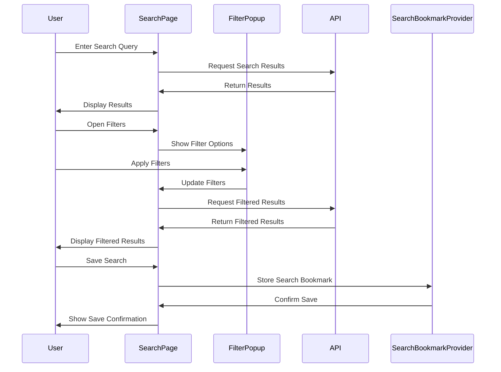

Seq1



Notification seq diagram:

```{.mermaid}
sequenceDiagram
    participant ST as Scheduled Trigger
    participant HT as HTTP Trigger
    participant CF as Cloud Functions
    participant FRD as Firebase Realtime DB
    participant IR as Itch.io RSS
    participant FCM as Firebase Cloud Messaging
    participant UA as User App

    alt Scheduled Trigger
        ST->>CF: Trigger notifyFeedScheduled
    else HTTP Trigger
        HT->>CF: Trigger notifyFeedHttp
    end

    CF->>FRD: Get topics to notify
    FRD-->>CF: Return topics

    loop For each topic
        CF->>FRD: Get old items
        FRD-->>CF: Return old items
        CF->>IR: Fetch new items
        IR-->>CF: Return new items
        CF->>CF: Compare old and new items
        CF->>FRD: Update stored items
        alt New items found
            CF->>FCM: Send notification
            FCM->>UA: Deliver notification
        end
    end
```

Simple architecture diagram:

```{.mermaid}
graph TB
    subgraph Client
        A[Flutter App]
        B[State Management]
    end
    subgraph Firebase
        C[Authentication]
        D[Firestore]
        E[Cloud Functions]
        F[Cloud Messaging]
    end
    subgraph "Itch.io"
        G[OAuth API]
        H[RSS Feeds]
        I[Web Content]
    end
    A <--> B
    A <--> C
    A <--> D
    A <--> F
    B <--> D
    C <--> G
    E <--> D
    E <--> F
    E <--> H
    A <--> I
```


Oauth diagram seq:


```{.mermaid}
sequenceDiagram
    participant U as User
    participant A as App
    participant OS as OAuthService
    participant IO as Itch.io OAuth
    participant SP as SharedPreferences
    U->>A: Open App
    A->>OS: Check Auth State
    OS->>SP: Check for stored token
    alt Token Exists
        SP->>OS: Return Token
        OS->>A: User Authenticated
        A->>U: Show Main View
    else No Token
        A->>U: Show Login Screen
        U->>A: Click Login
        A->>OS: Start OAuth
        OS->>IO: Redirect to Itch.io OAuth
        IO->>U: Request Permissions
        U->>IO: Grant Permissions
        IO->>OS: Return Access Token
        OS->>SP: Store Token
        OS->>A: User Authenticated
        A->>U: Show Main View
    end
```

overall view of widgets:

```{.mermaid}
classDiagram
    class Main {
        main()
    }

    class MainView {
        BottomNavigationBar
        PageView
    }

    class AuthOrMainView
    class AuthPage
    class HomePage
    class SearchPage
    class JamsPage
    class FavoritePage
    class ProfilePage
    class SettingsPage
    class GameWebViewPage

    class Game
    class Jam
    class User
    class SavedSearch
    class Filter
    class ItemType
    class JamGame
    class Option
    class PurchasedGame

    class FavoriteProvider
    class PageProvider
    class ThemeNotifier
    class SearchBookmarkProvider
    class FilterProvider
    class ItemTypeProvider
    class JamsProvider
    class SavedSearchesProvider
    class SearchProvider
    class UserProvider

    class OAuthService
    class NotificationService

    class BottomNavigationBar
    class CarouselCard
    class CustomAppBar
    class DevelopedGameCard
    class FilterPopup
    class FilterRowWidget
    class GameCard
    class JamCard
    class ResponsiveGridListGame
    class ResponsiveGridListJams
    class SavedSearchList
    class SearchBar

    Main --> AuthOrMainView : Starts
    AuthOrMainView --> MainView : Contains
    AuthOrMainView --> AuthPage : Contains
    MainView --> HomePage : Contains
    MainView --> SearchPage : Contains
    MainView --> JamsPage : Contains
    MainView --> FavoritePage : Contains
    MainView --> ProfilePage : Contains
    MainView --> SettingsPage : Contains

    HomePage ..> Game : Uses
    SearchPage ..> Game : Uses
    JamsPage ..> Jam : Uses
    FavoritePage ..> Game : Uses
    FavoritePage ..> Jam : Uses
    ProfilePage ..> User : Uses
    ProfilePage ..> Game : Uses

    FavoriteProvider --> Game : Manages
    FavoriteProvider --> Jam : Manages
    PageProvider --> MainView : Manages
    ThemeNotifier --> MainView : Manages
    SearchBookmarkProvider --> SavedSearch : Manages
    FilterProvider --> Filter : Manages
    ItemTypeProvider --> ItemType : Manages
    JamsProvider --> Jam : Manages
    SavedSearchesProvider --> SavedSearch : Manages
    SearchProvider --> Game : Manages
    UserProvider --> User : Manages

    OAuthService --> AuthPage : Authenticates
    NotificationService --> MainView : Notifies

    MainView ..> BottomNavigationBar : Uses
    HomePage ..> CarouselCard : Uses
    HomePage ..> SavedSearchList : Uses
    SearchPage ..> FilterPopup : Uses
    SearchPage ..> ResponsiveGridListGame : Uses
    JamsPage ..> ResponsiveGridListJams : Uses
    ProfilePage ..> DevelopedGameCard : Uses
```


Overview flutter architecture:

```{mermaid}
graph LR
    A[Views] --> B[Widgets]
    A --> C[Services]
    A --> D[Providers]
    B --> C
    B --> D
    C --> E[External Services]
    D --> E
    D --> F[Models]
```