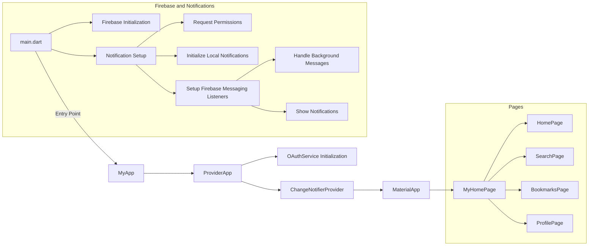

### Access OAuthService in Widgets

Now, anywhere in your app where you need to access the `OAuthService`, you can do so with `Provider.of<OAuthService>(context)` or `Consumer<OAuthService>`. For example, if you have a login button, you could use:

```dart
ElevatedButton(
  onPressed: () {
    // Accessing the OAuthService from the provider to start the OAuth process
    Provider.of<OAuthService>(context, listen: false).startOAuth();
  },
  child: Text('Login'),
)
```

### Listen for Changes and Access Token

If you need to react to changes in the access token (for example, updating the UI upon successful login), you might consider extending `OAuthService` with `ChangeNotifier` and calling `notifyListeners()` when the access token changes. Then, use a `Consumer<OAuthService>` widget to rebuild parts of your UI in response to these changes.


## Firebase stuff 


Firebase functions can be triggered by HTTP requests or scheduled to run at specific time:

  - HTTP reqs:
    - 
    - 
  - scheduled: 
    - 
    - 


Firebase Cloud Messaging (FCM)

stuff like firebase console -> select the projet -> project settings -> your apps ->  setup for flutter is necessary! 


Remember to update always the dependencies in `package.json` and always `npm install`  

```xml
"dependencies": {
    "firebase-admin": "^10.0.0",
    "firebase-functions": "^3.15.0",
    "node-fetch": "^2.6.1",
    "rss-parser": "^3.12.0" 
  },
```

the dependencies! 


To deploy a function:

```bash
firebase deploy --only functions
``` 

but always test locally: 

```bash
firebase emulators:start
```




